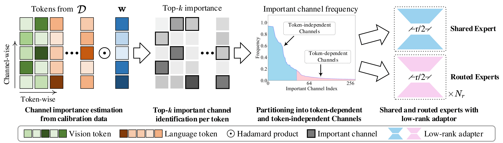
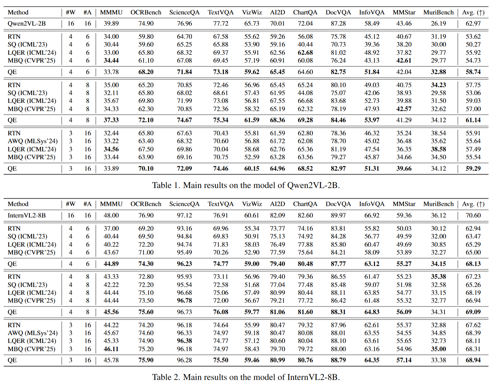

# Quant Experts: Token-aware Adaptive Error Reconstruction with Mixture of Experts for Large Vision-Language Models Quantization

[](https://arxiv.org/abs/2602.24059) [](https://cvpr.thecvf.com/) [](https://opensource.org/licenses/MIT)

**Keywords:** Vision-Language Models (VLMs) · Post-training Quantization (PTQ) · Mixture of Experts (MoE) · Adaptive Error Reconstruction

## Abstract

Post-Training Quantization (PTQ) has emerged as an effective technique for alleviating the substantial computational and memory overheads of Vision-Language Models (VLMs) by compressing both weights and activations without retraining the full model. Existing PTQ methods primarily rely on static identification and global compensation of sensitive or outlier channels, yet they often overlook the distributional differences of these important channels across inputs, leading to unsatisfactory quantization. In this work, we observe that the distributions and occurrence frequencies of important channels vary significantly both across modalities and among tokens, even within the same modality. Accordingly, we propose **Quant Experts (QE)**, a token-aware adaptive error compensation with mixture-of-experts for VLMs quantization. QE divides the important channels into token-independent and token-dependent groups. For the former, a shared expert is designed for most tokens to compensate for global quantization error using a low-rank adapter. For the latter, routed experts including multiple routed low-rank adapters are elaborated to compensate for local quantization error related to specific tokens. Extensive experiments demonstrate that QE consistently enhances task accuracy across various quantization settings and model scales, ranging from 2B to 70B parameters, while maintaining performance comparable to full-precision models.

## Overview

<p align="center">
	
</p>

## Results

<p align="center">
	
</p>

## Code

**Coming soon!** The code will be released here shortly.

## Citation

If you find QE useful in your research, please consider citing:

```bibtex
@inproceedings{qe_cvpr2026,
	title   = {Quant Experts: Token-aware Adaptive Error Reconstruction with Mixture of Experts for Large Vision-Language Models Quantization},
	author  = {Chenwei Jia, Baoting Li, Xuchong Zhang, Mingzhuo Wei, Bochen Lin, Hongbin Sun},
	booktitle = {Proceedings of the IEEE/CVF Conference on Computer Vision and Pattern Recognition (CVPR)},
	year    = {2026}
}
```

## License

This project is released under the MIT license. See [LICENSE](LICENSE) for details.

